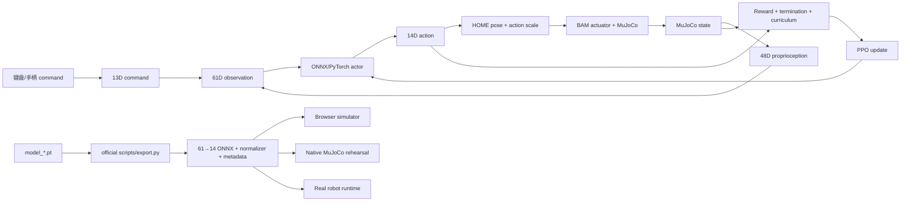

# 00 · 系统地图与最重要代码

## 一句话结论

要学习和复现强化学习，先把注意力放在：

```text
pollen-robotics/microduck_rl
```

`MicroDuckModels` 负责“看策略如何运行”，`microduck-replica` 负责“看机器人如何装起来”，`awesome-microduck` 负责“看社区还有什么”。只有官方 `microduck_rl` 包含完整的并行环境、reward、PPO、sim2real 随机化和 checkpoint→ONNX 路径。

## 总体系统



控制周期：

```text
MuJoCo physics timestep = 0.005 s
Decimation              = 4
Policy/control period   = 0.020 s
Policy frequency        = 50 Hz
```

## Observation、Command、Action

### 61D actor observation

```text
base angular velocity        3
projected gravity            3
joint position offset       14
joint velocity              14
last action                 14
command                     13
--------------------------------
total                       61
```

不要改顺序。策略不是按名字读取输入，而是按固定 tensor slot 读取。

### 13D command block

```text
twist command                3  [vx, vy, wz]
head-pose command            4
body-pose command            6
--------------------------------
total                       13
```

一个 task 不使用某些 command slot 时也应保留并 zero-pad，不能随意删除维度。这使 walk、stand、sit、trick 等策略能被 runtime 热切换。

### 14D action / joint order

```text
0  left_hip_yaw
1  left_hip_roll
2  left_hip_pitch
3  left_knee
4  left_ankle
5  neck_pitch
6  head_pitch
7  head_yaw
8  head_roll
9  right_hip_yaw
10 right_hip_roll
11 right_hip_pitch
12 right_knee
13 right_ankle
```

整机有 15 个舵机，但 walking policy 只控制上述 14 轴；喙/下颚驱动不在 locomotion action space 中。

---

# 1. `pollen-robotics/microduck_rl`：最重要

固定版本：

```text
d424a0c899f6b33cbd3daeb279913134349c0b63
```

## 建议阅读顺序

### 1. `AGENTS.md`

先读这里。它不是普通 agent 提示词，而是项目开发者总结的训练不变量和 reward 设计经验，包括：

- 61D observation 不可破坏；
- 14 个 servo joint 的顺序；
- passive joint 命名规则；
- BAM actuator 下不能错误 randomize `dof_frictionloss`；
- normalizer 必须进入 ONNX；
- reward sign 的双重取负陷阱；
- reward hacking、jackpot、curriculum、reverse spawn 等经验；
- 必须先跑 `64 env × 5 iterations` smoke test。

### 2. `src/mjlab_microduck/tasks/microduck_velocity_env_cfg.py`

这是 walking 主配方，也是最值得逐行阅读的文件。

主要内容：

- `ENABLE_*` domain-randomization 开关；
- command ranges；
- flat/rough terrain；
- contact sensors；
- observation terms 和 noise；
- reward terms 与权重；
- termination；
- curricula；
- PPO runner config；
- actor/critic 网络配置。

第一次自定义实验只改这个文件中的一个变量，例如：

```python
ENABLE_VELOCITY_PUSHES = True
```

### 3. `src/mjlab_microduck/tasks/mdp.py`

所有 MicroDuck 自定义 MDP 函数的集中位置：

- reward functions；
- observation helpers；
- event/reset functions；
- curricula；
- command classes；
- servo joint mapping helpers；
- NaN guards。

当配置文件出现：

```python
RewardTermCfg(func=microduck_mdp.some_reward, ...)
```

就到这里阅读实际数学和符号。

### 4. `src/mjlab_microduck/robot/microduck_constants.py`

这是 robot/action contract 的核心：

- HOME frame / default pose；
- robot model variants；
- actuator selector；
- BAM XL330 参数；
- action scale；
- servo joint names；
- walking/all-collision/roller model 配置。

如果 ONNX 在一个 simulator 中正常、在另一个 simulator 中异常，首先比较这里与部署端的：

```text
joint order
HOME/default pose
action scale
control frequency
```

### 5. `src/mjlab_microduck/actuator/friction_dr_bam.py`

理解 sim2real 的重点：

- BAM 电压控制执行器模型；
- 摩擦 randomization；
- 电压、压降、延迟；
- backlash encoder feedback。

MicroDuck 很小，XL330 执行器动力学占 sim2real gap 的比例很大。理想位置 PD 能让 sim 看起来好，却更可能在真实硬件上失效。

### 6. `src/mjlab_microduck/tasks/__init__.py`

任务注册表。`uv run list-envs` 的 task ID 来源于此。新增 task 时必须注册。

### 7. `src/mjlab_microduck/tasks/backlash.py`

把普通 task 包成 `-Backlash-` 变体，保持 observation/action 维度不变。

### 8. `src/mjlab_microduck/robot/microduck/`

MJCF、scene、mesh 与 model variant：

```text
robot_walk.xml                  walking，简化非足部碰撞
robot_allcollisions.xml         起身/坐立/翻滚/踢球等
robot_allcollisions_rollers.xml 轮式 task
scene*.xml                      原生 MuJoCo inference 场景
```

### 9. `scripts/export.py`

唯一推荐的 checkpoint→ONNX 路径：

- 加载 RSL-RL runner；
- 加载本地 checkpoint 或 W&B run；
- 导出 actor；
- 把 observation normalizer 烘焙进 graph；
- 附加 metadata。

### 10. `scripts/infer_policy.py`

部署预演：

- 原生 CPU MuJoCo；
- 读取多个 ONNX；
- 构建与 runtime 一致的 observation；
- 50 Hz policy loop；
- command、policy switching、CSV、record；
- walking/standing/sitstand/kick/roulade 等策略组合。

### 11. `tests/`

不要把它当形式检查。这里锁定：

- joint mapping；
- reward sign；
- config invariants；
- NaN guards；
- ARM64 CUDA wheel route 等部署细节。

---

# 2. `pollen-robotics/microduck`：官方 runtime 与模型源

固定版本：

```text
590b986bd8c0d50ae02cb3ea2f59c463b6828168
```

第一轮最重要位置：

```text
policies/
```

其中含官方 ONNX：

```text
alpha_walking.onnx
alpha_stand.onnx
alpha_sitstand.onnx
alpha_ground_pick.onnx
ball_kick_left.onnx
ball_kick_right.onnx
roulade.onnx
roller.onnx
roller_crouch.onnx
```

这些是“已知良好”的部署基线。训练自己的 walking policy 前，先证明官方 `alpha_walking.onnx` 在你的 `infer_policy.py` 和浏览器中正常运行。

继续学习实体部署时再看：

```text
docs/design/
docs/robot/
deploy/
robotd 相关 crate
duck-control 相关代码
```

重点追踪：

```text
50 Hz runtime loop
61D observation construction
policy session switching
Dynamixel bus
IMU input
fall detection
ONNX Runtime invocation
```

---

# 3. `IronSpiderMan/MicroDuckModels`：最快理解部署闭环

固定版本：

```text
f336dc0a984e8c7bf46e350cb541de54fe1bf9f8
```

## 最重要文件

### `src/game/constants.js`

先读：

```text
POLICIES
JOINT_NAMES
DEFAULT_POSE
NUM_JOINTS = 14
OBS_SIZE = 61
CMD_SIZE = 13
ACTION_SCALE = 1.0
TIMESTEP = 0.005
DECIMATION = 4
```

### `src/game/game.js`

按搜索顺序阅读：

```text
bootGame
InferenceSession.create
buildPhysicsXml
resolveAddrs
buildObs
activeSession
controlStep
session.run
data.ctrl
mj_step
recovery
```

这里能看到：

```text
MuJoCo WASM load
MJCF compile
ONNX load
61D observation construction
14D action to ctrl
4 substeps / policy step
fall detection + stand policy switching
browser render rig synchronization
```

### `public/policies/`

浏览器实际加载的 ONNX 文件。

## 学习边界

此仓库没有：

```text
rollout buffer
advantage estimation
critic update
PPO optimization
reward computation
backpropagation
```

因此它是 inference/deployment simulator，不是 training repo。

---

# 4. `fanhao375/microduck-replica`：机械结构逆向

固定版本：

```text
652f7ba86f56e7243b91b36c229977d882e36bc6
```

最重要位置：

```text
README.md                       当前逆向结论和边界
PROGRESS.md                     证据与进度
scripts/render_assembly.py      MJCF→装配/爆炸图
scripts/export_assembly_stl.py  应用世界变换并按刚体导出
scripts/analyze_holes.py        STL 孔特征分析
cad/                            变换后的 assembly STL
assembly-drawings/              装配图
```

它适合回答：

- 每个关节挂在谁下面；
- 质量和惯量在哪里；
- 为什么头部重心影响 walking；
- 15 个舵机与 14D action 为什么不矛盾；
- 哪些 STL 只是仿真外形，而非制造 CAD。

不应默认这些模型已经解决：

```text
打印收缩
配合公差
螺纹
热熔螺母座
走线
真实装配验证
```

---

# 5. `joeynyc/awesome-microduck`：第二阶段导航

固定版本：

```text
9ef86882a1ea913c771c3169b533c020a3a1b286
```

它列出：

- 官方 runtime / RL；
- Genesis 与 AMD/ROCm 端口；
- Isaac Lab 端口；
- DGX Spark workspace；
- 社区 task/policy；
- MCP/agent 工具；
- App、AR 和手机端；
- 机械复刻。

正确使用顺序：先完整掌握官方 `microduck_rl`，再用 Awesome List 选择一个迁移目标做 A/B。不要第一天同时安装官方、Genesis 和 Isaac Lab；否则问题来源不可区分。
